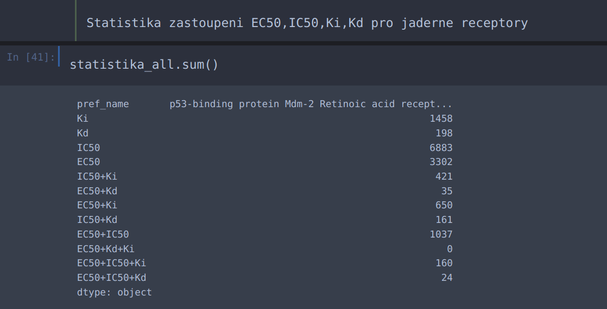
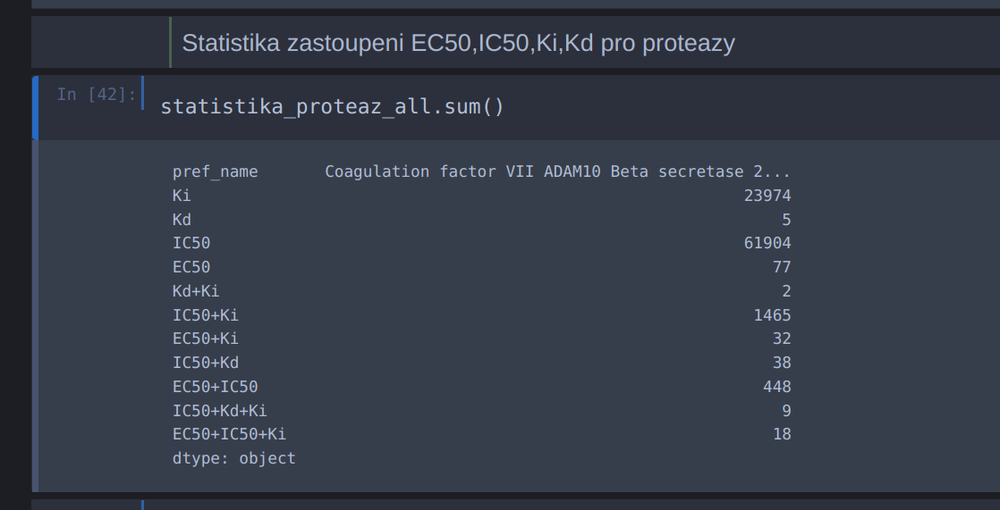
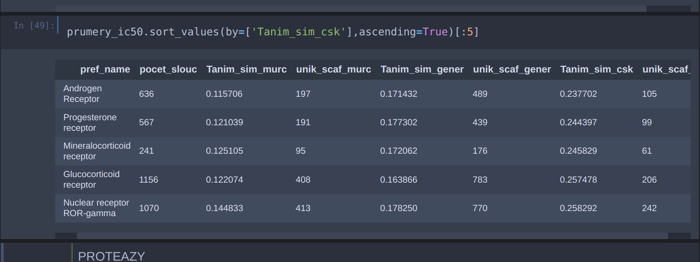
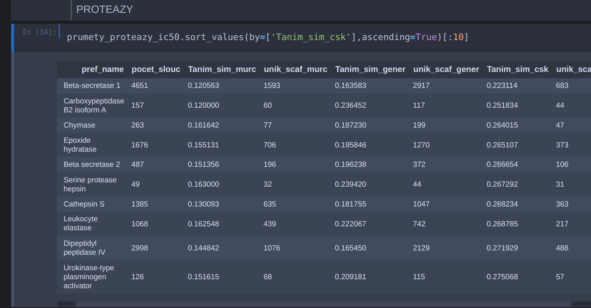
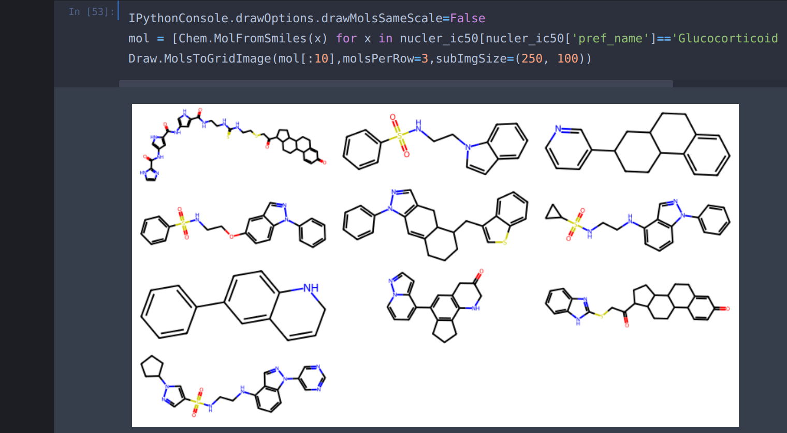
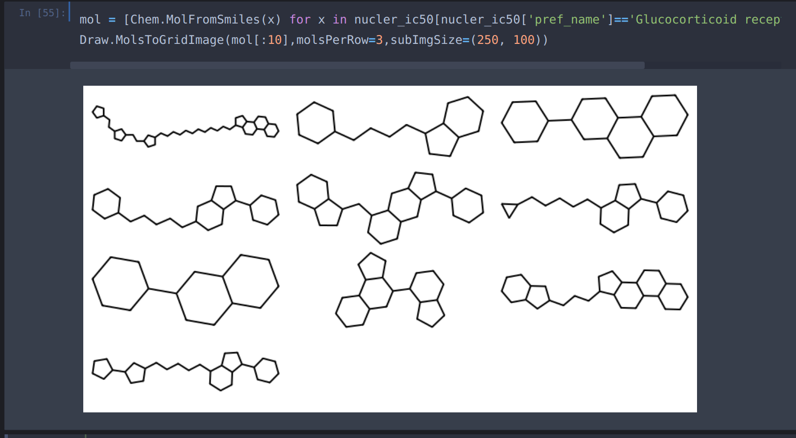

31.1.2023-24.2.2023

## Important informations:
* ChEMBL 31: download 18.1.2023
* conda environment is rdkit-env(conda activate rdkit-env)
* data are download in 22.02.2023

# Nazev: Vývoj metodiky pro vyhodnocování kvality molekulových generátorů

## Vyber vhodneho biologickeho cile:
Je potreba vybrat dva biologicke cile pro tento projet, bylo zvoleno ze budou se vybirat z jadernych receptoru a proteaz. 

Pomoci scriptu Wima (*get_chembl_data_own_scripts.py*) byli vybrane nejprve targety pro jaderny receptor a pak nasledne byli stazene ligandy, ktere byli anotovane EC50,IC50,Ki,Kd a pro ketre byla jejich standrardni typ '=' a standardni hodnota
* pro jaderny receptor  <0-100> nM.
* pro proteazy <0-1000> nM 
* **podle clanku https://druggablegenome.net/ProteinFam byli zvolene thresholdy aktivit** 

* pro jaderny receptor: l1 = "Other nuclear protein",l2 = "Nuclear receptor"
* pro protease: l1 = 'enzym',l2 = 'protease'

* obecne parametry: 
    * activities.potential_duplicate = '0' 
    * activities.data_validity_comment is null  
    * activities.standard_relation = '=' 
    * activities.standard_units = 'nM' 
    * assays.confidence_score IN ('7','8', '9') 
    * activities.standard_type IN ('EC50', 'IC50','Ki','Kd') 
    * compound_properties.full_mwt>100 AND compound_properties.full_mwt < 1000 
    * activities.pchembl_value > 0 AND activities.pchembl_value < 100 

### statistika jednotlivych zastoupeni EC50,IC50,Ki,Kd
Znela otazka jestli ma cenu michat dohromady ruzne hodnoty namerenych assay (EC50,IC50,Ki,Kd)
Proto znel navrh pripravit statistiku a se podivat jakych hodnot bylo vypocitano nejvic pro jendotlive receptory

Na obrazku jsou zobrazene sumarni hodnoty pro jaderny receptory a proteazy.
Spocitana data pro jendotlive targety jsou ulozene v slozce */results/results_data_for_chosen_perfect_target/*
* statistics_for_nuclear_receptors.csv
* statistics_for_proteases.csv

Podle statistiky muzeme videt ze vetsinou jsou spocitane hodnoty IC50 v obou pripadech a proto jsme rozhodli misto toho abychom michali hodnoty budou vybrane jenom slouceniny s definovanou IC50 a na z nich budou vytvorene datove mnoziny.

Z ChEMBL byli stazene slouceniny s definovoanou IC50 a pak na nich byla provedene scaffoldova analyza, kterou potrebujeme pro vyber vhodneho biologickeho targetu. potrebujeme aby scaffoldova diverzita byla co nejvic. Takze aby ty scaffoldy co nejvic byli nepodobne jeden druhemu.

Byli vzate slouceniny SMILES a byli provedene upravy datasetu/sloucenin:
* odstranene slouceniny ktere neobsahuji ring system, 
* slouceniny ktere obsahuji SF6 byli prevedene na CF3, 
* slouceniny ktere obsahuji sul tak sul byla odstranena

Pro vyber typu scaffoldu ktery bude pouzit, jsme zkusili tri ruzne scaffoldy a podivali jsme se na Tanimotovou similarity a Pocet unikatnich scaffoldu. Scaffoldy ktere byli pouzite:
* Murcko scaffold - podle definice RDKit
* Generic scaffold - podle definice RDKit
* CSK (cyclic skeleton)(https://pubs.acs.org/doi/pdf/10.1021/ci200179y) - pro vytvoreni tohoto scaffldu byl pouzit nastroj RDKit - nejprve sloucenina byla prevedena na Generic_scaffold a pak nasledne na Murcko scaffold podle definice RDKit.

Nasledne jednotlive scaffoldy byli prevedene na Morganuv fingerprint r=3,  nBit = 2048, a byla spocitana Tanimotova similarita, pak vysledky byli serazene podle Tanimitova similarity od nejnizsi k nejvyssi:

Pak byli byli jednotlive smiles prevedene na morganuv fingerprint r=3,  nBit = 2048, pro ktere byla spocitana tanimotova distance(distsimilarity) takze cimn vetsi hodnota tim je to lepsi. Nejprve byla spocitana tanimotova prumerna hodnota a zastoupeni jednotlivych trid a taky byla provedene shulkova anlyza pro vizualizaci jednotlivych ligandu.

### Zobrazeni jednotlivych scaffoldu murcko a csk, abychom se podivali jak vypadaji

Podle nas nejlepsi vyber scaffoldu budou CSK, nejsou moc specificke jako murco a generic.
Podle vypocitaneho Tanimotova distance a poctu sloucenin a poctu uniatnich caffoldu csk zvolili jsme:
* pro jaderny receptor: **Glucocorticoid receptor**
* pro proteazu: **Leukocyte elastase**

Data sety z vypocitanou hodnotou Tanimota similarity a unikatnich scaffoldu jsou v slozce *results/results_data_for_chosen_perfect_target/*
* nuclear_IC50_value_for_Tanimot_similarity.csv
* protease_IC50_value_for_Tanimot_similarity.csv

Data sety ktere byli pouzite a jsou ulozene v slozce *results/results_data_for_chosen_perfect_target/*:
* nuclear_all_assay_together_EC50,IC50,Ki,Kd.csv
* protease_all_assay_together_EC50,IC50,Ki,Kd.csv
* nuclear_IC50_all_targets.csv
* protease_IC50_all_targets.csv
tyhle ctyri obsahuji vypocitane jednotlive scaffoldy (murco, generic, csk)

EC50:

IC50:

## Rozdeleni na testovaci a trenovaci sady

## Beh jednotlivych generatoru

## Vypocet jednotlivych metrik

## Statisticka analyza dat a vizualizace